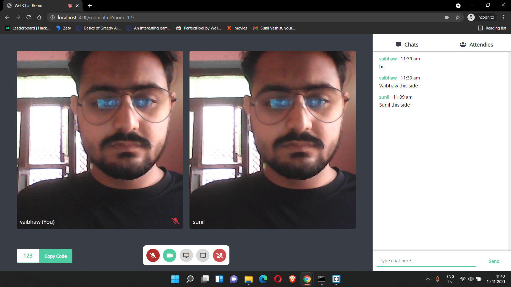
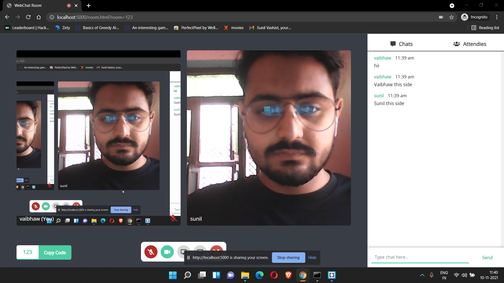

# quickmeet
A video chat/meeting webapp using WebRTC and WebSockets (socket.io). Basically a Google Meet clone + a collaborative whiteboard.
  

## Current Features?

1. Video Calls
2. Chatbox
3. Collaborative Whiteboard
4. Screensharing

## Upcoming Features?

2. Responsive front-end for Rooms

## Contributions?

Feel free to make a PR.
